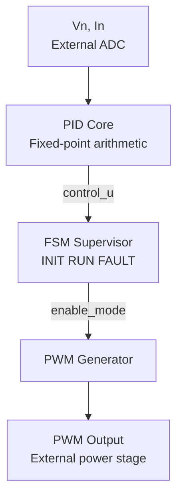
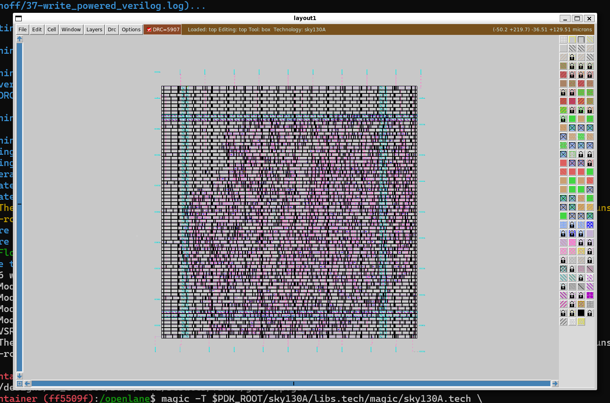

# 🔋 V–I Control ASIC on SKY130  
**PID × FSM × PWM using OpenLane**  
*Educational & Practical Reference Design*

[](https://samizo-aitl.github.io/portal/en/)

---

## 🔗 Official Links

| 🌐 Language | GitHub Pages | GitHub Repository |
|-----------|--------------|-------------------|
| 🇺🇸 English | [](https://samizo-aitl.github.io/vi-control-asic-sky130/) | [](https://github.com/Samizo-AITL/vi-control-asic-sky130/tree/main) |

---

## 📌 Project Overview

This repository provides a **complete, reproducible, tapeout-oriented**
example of a **digital control ASIC** based on **Voltage–Current (V–I) feedback**.

> ⚠️ This is **NOT** a tutorial fragment or tool demo.  
> ✅ This is a **finished and verified reference ASIC design**.

---

## 🧩 What This Project Contains

- 🧮 **PID control**  
  Fixed-point, deterministic digital implementation

- 🧠 **FSM-based supervision**  
  `INIT / RUN / FAULT` operational control

- ⏱ **PWM generation**  
  Duty-cycle and timing output

- 🛠 **RTL → GDS flow**  
  Using **OpenLane**

- 🧱 **SKY130 standard-cell technology**

📎 **ADC / DAC are assumed external**  
→ This project focuses on **pure digital ASIC control logic**

---

## 🎯 Design Scope & Philosophy

This project is designed to be both:

| 📘 Educational | 🧩 Practical |
|---------------|-------------|
| Explains *why* design choices are made | Shows *how* to implement real silicon |
| Control theory → hardware mapping | RTL → GDS → signoff |
| Fixed-point methodology | Industry-grade verification |

### 🔄 Design Flow

```
Control Theory
 → Fixed-Point Arithmetic
   → RTL Design
     → Functional Verification
       → OpenLane
         → GDS (Tapeout-ready)
```

---

## 🧠 Architecture Overview



---

## 🧮 Control Structure Notes

- **PID Core**
  - Error calculation based on V–I feedback
  - Fixed-point arithmetic (deterministic, synthesizable)
  - P / I terms verified independently

- **FSM Supervisor**
  - Guards unsafe operation
  - Handles startup, normal run, and fault states
  - Enables / disables PWM generation

- **PWM Generator**
  - Converts control effort to duty cycle
  - Timing verified at RTL and gate level

---

## 📚 Documentation

All technical documentation lives under `docs/`.

👉 **Entry point:**  
🔗 **[Documentation Index](docs/index.md)**

### Documentation Flow

1. System overview & design philosophy  
2. Control model (PID with V–I feedback)  
3. Fixed-point design methodology  
4. RTL architecture  
5. FSM supervision & PWM logic  
6. OpenLane RTL-to-GDS flow  
7. Gate-level functional verification  
8. Appendix (figures & references)

---

## ✅ Verification Status

This project is **verification complete within its defined scope**.

### ✔ Completed

- ✅ RTL functional simulation  
- ✅ PID step response verification (P / PI)  
- ✅ FSM state transition verification  
- ✅ PWM duty & timing verification  
- ✅ Gate-level **functional** simulation (post-layout)  
- ✅ Static Timing Analysis (STA) closure  
- ✅ DRC / LVS clean (OpenLane)

### ⏭ Intentionally Omitted

- ⛔ Gate-level **timing simulation**  

> STA is used instead.  
> UDP-based SKY130 timing models are not simulator-friendly.

➡️ This reflects **real-world ASIC development practice**.

---

## 🖼 Physical Implementation



| Item | Details |
|----|----|
| Tool | OpenLane |
| PDK | SKY130A |
| Status | DRC / LVS clean, GDS generated |

---

## 🎓 Intended Audience

- 🎓 Students learning **digital control & ASIC design**
- 🧑‍💻 Engineers transitioning from **MCU-based to hardware control**
- 🏫 Educators building **semiconductor coursework**
- 🧪 Developers evaluating **OpenLane + SKY130**

---

## 👤 Author

| 📌 Item | Details |
|--------|---------|
| **Name** | Shinichi Samizo |
| **Expertise** | Semiconductor devices (logic, memory, high-voltage mixed-signal)<br>Thin-film piezo actuators for inkjet systems<br>Printhead productization, BOM management, ISO training |
| **GitHub** | [](https://github.com/Samizo-AITL) |

---

# 📄 License

[](https://samizo-aitl.github.io/vi-control-asic-sky130/#---license)

| 📌 Item | License | Description |
|--------|---------|-------------|
| **Source Code** | [**MIT License**](https://opensource.org/licenses/MIT) | Free to use, modify, and redistribute |
| **Text Materials** | [**CC BY 4.0**](https://creativecommons.org/licenses/by/4.0/) or [**CC BY-SA 4.0**](https://creativecommons.org/licenses/by-sa/4.0/) | Attribution required; share-alike applies for BY-SA |
| **Figures & Diagrams** | [**CC BY-NC 4.0**](https://creativecommons.org/licenses/by-nc/4.0/) | Non-commercial use only |
| **External References** | Follow the original license | Cite the original source properly |

---

# 💬 Feedback

> Feedback, ideas, and discussions are welcome.

[](https://github.com/Samizo-AITL/vi-control-asic-sky130//discussions)


